# How Danceable Is My Playlist?

**Team 79:** Marissa Gardner, Alex Bates, Nathan Stefanik, Jill Patel

## Final Report

### 1. Introduction 
523.9 million users are on music streaming services listening to music and creating playlists (Götting, 2022). With the prevalence of music in this age, individuals are constantly looking to analyze their own listening habits through reports like Spotify Wrapped or Apple Music Replay (Pau, 2021; “Apple Music Replay”, 2022). One metric that these reports do not give is how danceable people’s music is. We hope to solve this problem by filling in that missing datapoint for interested music listeners. 

#### 1.1 Problem Definition 
We hope to create a playlist danceability analyzer that can take in a playlist and return the danceability of that playlist based on a large library of songs and their danceabilities, hence the project title “How Danceable Is My Playlist?” The motivation for this project is to use machine learning to predict a playlist’s danceability. By using information from a given playlist, such as song titles, loudness, duration, and acousticness, the danceability analyzer will predict the overall danceability of that playlist. Additionally, we also seek to predict the danceability of a recommended song to the playlist.

### 2. Data
The data for the project is sourced from two separate datasets, one which contains 1 million playlists from <a href = "https://www.aicrowd.com/challenges/spotify-million-playlist-dataset-challenge"> AIcrowd </a>, and one which contains 1.2 million songs from <a href = "https://www.kaggle.com/datasets/rodolfofigueroa/spotify-12m-songs"> kaggle </a> (De Boom 2020; Bertin-Mahieux et al., 2011). 

**Data in the Playlist Dataset from AIcrowd:**
- name: a string, the title of the playlist
  - collaborative: a boolean, whether others can edit the playlist
  -  pid: an integer, the playlist ID
  - modified_at: an integer, the last time the playlist was changed
  - num_albums: an integer, the number of albums represented in the playlist
  - num_tracks: an integer, the number of songs on the playlist
  - num_followers: an integer, the number of people who are following the playlist
  - num_edits: an integer, the number of times the playlist was changed
  - duration_ms: an integer, the total duration of the playlist, in milliseconds
  - num_artists: an integer, the number of artists represented in the playlist
  - tracks: a list, song objects that represent each track in the playlist 
    - pos: an integer, the position of this song in the playlist
    - artist_name: a string, the name of the artist of the song
    - track_uri: a link, the URI to the song’s page
    - artist_uri: a link, the URI to the artist’s page
    - track_name: a string, the title of the song
    - album_uri: a link, the URI to the album’s page
    - duration_ms: an integer, the duration of the song in milliseconds
    - album_name: a string, the name of the album the song is from

An important note here is that the Alrcowd dataset does not have the danceability of a playlist, so we define ***playlist_danceability*** ourselves as the average danceability of the songs in that playlist. That is, for each song in a playlist for which we have corresponding data in the kaggle dataset, we will average those danceability values from the kaggle dataset to form the playlist danceability label for a given playlist.

**Songs Dataset from kaggle:**
- id: a string, characters that represent the unique id of the song in the dataset
- name: a string, the title of the song
- album: a string, the name of the album
- album_id: a string, characters that represent the unique id of the album in the dataset
- artists: a list, a list of artist_ids that represent artists who perform the song
- artists_ids: a string, characters that represent the unique ids of the artists in the dataset
- track_number: an integer, the number of the song in the dataset
- disc_number: an integer, the number of the disc in the dataset that the song is stored on
- explicit: a boolean, whether the song is explicit or not
- ***danceability***: a float, a value between 0 and 1 representing how danceable a song is (0 is not danceable and 1 is completely danceable)
- energy: a float, a value between 0 and 1 representing how energetic a song is
- key: an integer, a number representing the key of the song
- loudness: a float, a value between 0 and 1 representing the noise level of a song
- mode: an integer, a number representing the modality (major or minor) of a song 
- speechiness: a float, a value between 0 and 1 representing the amount of spoken word in a song
- acousticness: a float, a value between 0 and 1 that is a confidence level of whether the song is acoustic
- instrumentalness: a float, a value between 0 and 1 representing how vocal the song is (0 is totally vocal and 1 is totally instrumental)
- liveness: a float, a value between 0 and 1 representing how live versus studio recorded a song is, based on the reverberation time of sounds
- valence: a float, a value between 0 and 1 representing how happy a song is 
- tempo: a float, a value representing how fast or slow the beat of a song is
- duration_ms: an integer, the duration of the song in milliseconds
- time_signature: an integer, a number representing the time signature of the song
- year: an integer, a number representing the year the song was released
- release_date: an integer, a number representing the date the song was released

An important note here is that ***danceability*** “describes how suitable a track is for dancing based on a combination of musical elements including tempo, rhythm stability, beat strength, and overall regularity,” with 0.0 being “least danceable and 1.0 is most danceable” (Mahajan, 2021). We have the danceability values of each song, and to get the playlist danceability values, we simply average the danceabilities of all the songs on that playlist that are included in this kaggle dataset.

#### 2.1 Data Collection 
Since we aim to use supervised learning to predict a playlist’s danceability and the playlist dataset from AIcrowd lacks that feature, we needed to collect data from more than one dataset to find that missing piece for our labels. To this effort, we downloaded the datasets described above and made a playlist danceability label for each playlist. Below is a histogram of the danceabilities of all the songs in our song dataset (De Boom, 2020).

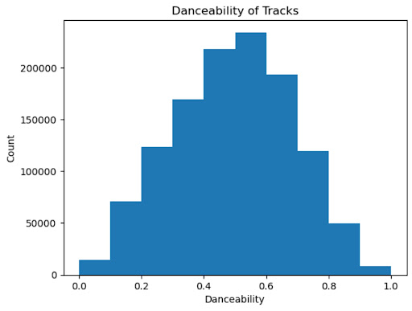

**Figure 1: Danceabilities of Songs in the Songs Dataset (kaggle)**

As shown above, the danceability of songs in the songs dataset follows a bell-shaped distribution, which is what we would expect with a dataset of over 1 million songs. Unfortunately, there are some inconsistencies across the two datasets. There are some songs that are in a playlist (in the AIcrowd dataset) that are not in the song (kaggle) dataset, which means we can not find those songs’ danceability scores. With this inconsistency, certain songs had to be removed from consideration when attempting to evaluate the overall danceability of a playlist for song recommendation. We decided to only consider a playlist if it was able to retain 50% of its songs after searching for its danceability in the song dataset. 

#### 2.2 Data Cleaning 
In order to make our data usable, we had to clean it. We cleaned our data in 5 main steps:

- 1. We evaluated each song and each playlist to ensure that its features had usable values. In particular, we decided to throw away any songs or playlists that had any “Not a Number” (NaN) values. 
- 2. We examined the features in the song dataset (kaggle) and decided to manually eliminate many that did not seem appropriate for predicting danceability; for example, we got rid of features like liveness which did not seem as important to determining danceability as defined above. We preferred to instead keep features like tempo and loudness, which are more directly relevant to a song’s danceability. This took us from 24 to 13 features.
- 3. Next, we had to match tracks in the playlist dataset (AIcrowd) to tracks in the song dataset (kaggle). This allowed us to get information on danceability for each song in each playlist. However, due to differences in the way the datasets represented the songs, not every song in the playlist dataset had a corresponding match in the song dataset. We decided to throw out any playlists that had fewer than 50% of its tracks matched in the song dataset. We decided on this threshold because this number of songs ensures that the playlist has a recognizable vibe that can be determined by our model. 
- 4. Similar to the approach described for creating our labels (playlist_danceability), we then defined features for each of the playlists we were able to keep in our dataset by taking the average value of those features for each song in the playlist that had a match in the song dataset.
- 5. Lastly, we normalized the numerical data for each feature to be values between 0 and 1 for future visualization purposes. This process left us with usable data.

#### 2.3  Data Pre-Processing
We used Principal Component Analysis (PCA) to take our number of features from 13 to 2. Using scikit learn’s PCA algorithm on the refined dataset of playlists, we got the following first principal component (Pedregosa et al., 2011).

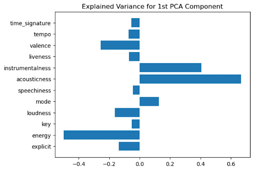

**Figure 2: Explained Variance for Each Feature in the First Principal Component**

Because the two features with the highest impact on the variance of the first principal component were acousticness and energy, we kept only those features to train our mode (Michael, 2021)l. As shown in the model below, these two features have a distinct impact on a song’s danceability.

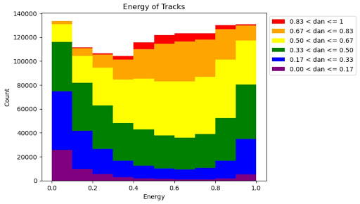

**Figure 3: Danceability by Energy Level**

In the figure above, we can see how danceability varies with increasing energy levels. At lower levels of energy, there are lower rates of songs with higher danceabilities, but as the energy levels increase, the proportion of songs with higher danceabilities also increases, following a U-shape.

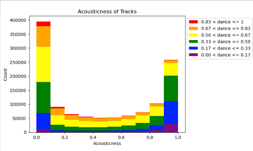

**Figure 4: Danceability by Acousticness Level**

On the other hand, in the figure above, we can see how the extreme values of acousticness lead to higher values of danceability than the middle values of acousticness. 

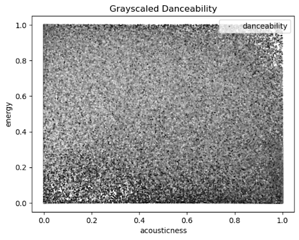

**Figure 5: Grayscaled Danceability by Energy and Acousticness**

In the diagram above, the darker regions represent higher levels of danceability while the lighter regions represent lower levels of danceability. We can see the aforementioned effects of extremely high and extremely low levels of acousticness influence higher levels of danceability. Additionally, we can see how low energy levels lead to some high levels of danceability when acousticness is also considered. Additionally, the high levels of energy can elicit high danceabilities despite middle-of-the-road acousticness levels typically eliciting low danceabilities. Therefore, it is good that we are using both of these features rather than one alone to predict danceability since they both have an influence on those values.

After reducing our dataset to only include these 2 features for each playlist in our clean dataset, we were able to begin our approach to predicting playlists’ danceabilities.

### 3. Methods
Our main idea behind processing a playlist and predicting its danceability is to use supervised learning, where our refined playlists dataset is the data and their corresponding playlist danceabilities are the labels. In total, we implemented 5 different Machine Learning Models - Linear Regression, Ridge Regression, Lasso Regression, Convolutional Neural Network, and Random Forest. We implemented the final 4 models (Ridge, Lasso, CNN, and RF) since the Midterm Report. This section provides a broad overview into each of these models. In the following section, we discuss the results for each of these models in depth.

#### 3.1 Linear Regression Implementation
Linear regression is a supervised learning algorithm (Brownlee, 2020). The inputs to our linear regression model were our cleaned dataset as X and their playlist danceability labels, described in Section 2, as Y. As determined by our PCA, we used the features energy and acousticness to determine the playlist danceability. Our linear regression model outputs a predicted danceability score, which is a value between 0 and 1, with 0 being not danceable and 1 being very danceable. We used the Linear Regression model from sklearn to implement this model for our problem.  

#### 3.2 Ridge Regression Implementation
Ridge Regression is a supervised learning algorithm which is used when the dataset has multicollinearity or when the number of predictor variables surpasses the number of observations (Stephanie, 2021). The input into this model is the cleaned playlist dataset as X, and the last song of each playlist’s danceability as the ground truth Y. However, for a playlist of length n, this model only learns the first n-1 songs. This is so that after running the algorithm, this model outputs a predicted danceability for the next song in the playlist. We used the Ridge Regression model from sklearn to implement this model for our problem.

#### 3.3 Lasso Regression Implementation
Lasso Regression is another supervised learning algorithm that is used for regularization for a more accurate prediction used for models with high multicollinearity or when feature selection is in play (Kumar, 2022). One benefit of lasso regression is that it has feature selection techniques built into it. This allows our model to focus on the features that contribute the most to danceability and give less importance to those features that have a smaller impact on danceability. With lasso regression our inputs were the cleaned dataset as X, and the last song of each playlist’s danceability as the ground truth Y. We used the Lasso Regression model from sklearn to implement this model for our problem.

#### 3.4 Convolutional Neural Network 
Ordered playlists may hold specific patterns regarding mood, tempo, and other interesting features much like album sequencing for official records. In this same vein, the ordering of the songs in the playlist might be another indicator for the danceabilities of later songs. 
Here we observe these patterns and use these sequences to predict danceabilities of later songs in a playlist. 

Originally, we were planning on capturing these sequential patterns by implementing a recurrent neural network (RNN) through the PyTorch library (Yehoshua, 2018). However, our RNN was not able to reconcile the shape of our input and desired output. Because of this, we decided to implement a convolutional neural network (CNN), instead. Upon further inspection, we decided that a CNN would be better suited for our problem because we can view our playlist’s features like black and white 2D images, a common input for CNNs. With this approach, each pixel in our “image” can be seen as a particular feature of a particular song in the playlist, where the brightness of the pixel is determined by the value of that feature. A visualization of this can be seen in the following image:
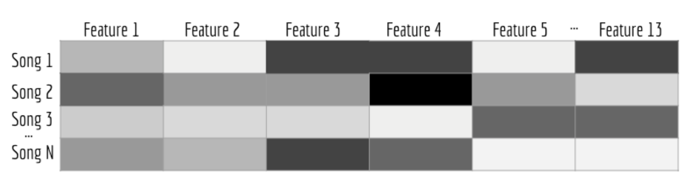
**Figure 6: Example CNN Data Visualization**

This representation of our data plays to the strengths of CNNs: we can determine the importance of various aspects of the “image” and learn how to differentiate one from the other. However, it is important to note here that using CNNs for regression is still an open problem in computer science. There is no widely accepted architecture used to solve regression problems like ours using a CNN.

We implemented our CNN using TensorFlow and Keras. In the end, we implemented a typical CNN with dense layers to get a continuous output for danceability.  Our convolution layers learn patterns in our playlist features array, and the dense layers learn how to take those patterns in and spit out a continuous number (the recommended song’s danceability). Our CNN used the following layers (shown in order):
- Convolution layer
- Batch normalization
- dropout
- Convolution layer
- Batch normalization
- dropout
- Convolution layer
- Batch normalization
- Dropout
- Convolution layer
- Batch normalization
- Dropout
- Flatten layer
- Dense 256 (256 = number of nodes)
- Dense 128
- Dense 64
- Dense 32
- Dense 16
- Dense 8
- Dense 4
- Dense 2
- Dense 1
While we worked for a significant amount of time tuning the parameters of the CNN, further work could be done to perfect the model architecture even further. A summary view of the model can be viewed in the following image:
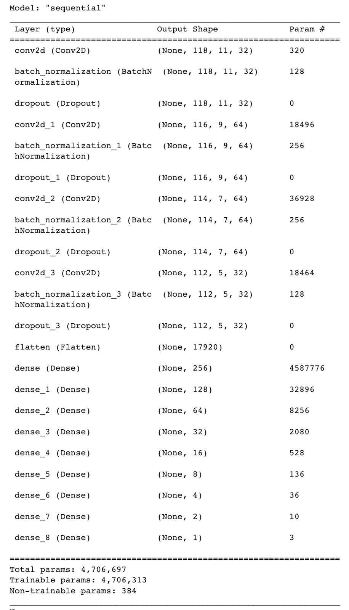

**Figure 7: CNN Model Summary View**

#### 3.5 Random Forest Implementation
Random Forest is the final model that we implemented for this project. Random forest is an ensemble learning method that constructs a number of decision trees when training the algorithm (Kam, 1995). Since this is a regression task, the random forest computes the average value outputted by each tree. Random forest is a more advanced form of the decision tree model, since it randomizes the sample data, trains many different trees on these different data sets, and aggregates these results into a final answer. Random forest performs well for our problem because it performs well given irrelevant features (Kam, 1995). As discussed in earlier sections, our data set has some features that are irrelevant to danceability. Additionally, during data pre-processing, we padded some playlist features with zeros if the length was too short. 

We implemented our random forest model using the TensorFlow Random Forest library. We trained the model using the default parameters, but future work could be done to more finely tune these. A summary view of the model can be viewed in the following image:

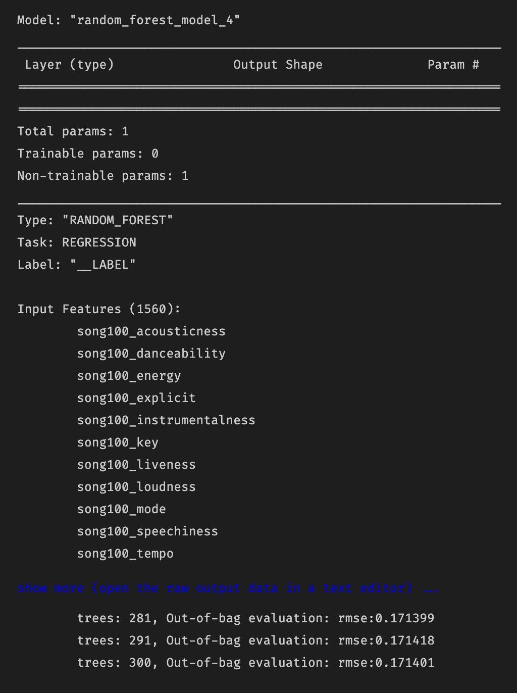

**Figure 8: Random Forest Model Summary View**

### 4. Results & Discussion
#### 4.1 Linear Regression
To give a better illustration of how our algorithm works, we have provided an example use case below.

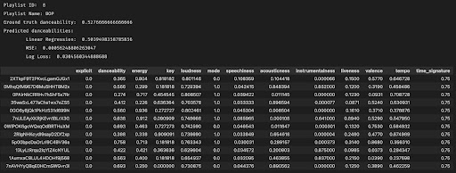

**Figure 9: Predicting the Danceability of Playlist 8**

Above, we have a playlist of songs that we fed our algorithm to predict its danceability. The list of songs in the playlist are shown in the bottom half of the screenshot, along with all of their features. We feed our algorithm the dataset that includes all of the songs and their energy and acousticness levels. Our algorithm produced a close match, 0.50395, to the ground truth value for this playlist’s danceability, which is 0.5276667. 

In Figure 9, we can see two different metrics we have used to analyze the results of our model. First, we calculate the mean squared-error between the predicted results and the ground truth. Mean squared-error (MSE) is a simple loss function that calculates the difference between predicted and ground-truth values, squares it, and computes the average value across the whole dataset (Binieli, 2018). For example, for one particular playlist, we calculated a MSE of 0.000562488, a very low value which indicates that, at least for this one particular playlist, our model performs well. The other metric we are using and plan to use more in depth in the final report is log loss. Log loss is a similar metric to MSE, since both, at a high level, compute the distance between our predicted values and the ground truth (Dembla, 2020). The higher the log loss value, the further away our predictions are from the true labels (Dembla, 2020). We computed the log loss value for this case as 0.0305, another low value. Since we normalized our values, both MSE and log loss can range between 0 and 1. Even when put into context against this range, our MSE and log loss values are still very low, indiciating our model is performing well and our predictions are accurate. 

To train and test our model, we used 10 K-Folds, which yielded the following result:
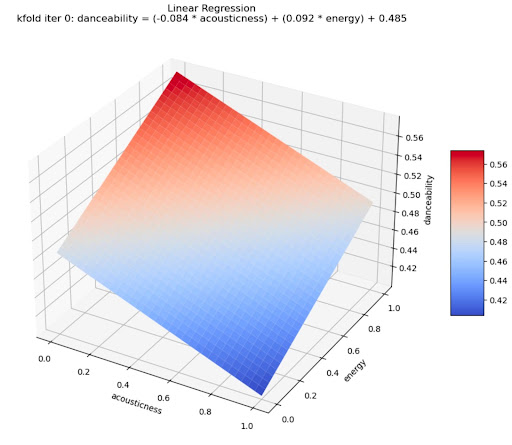

**Figure 10: Linear Regression Model**

For each K-Fold iteration, we used linear regression to fit the data according to acousticness and energy to predict danceability. For the first K-Fold iteration seen in Figure 6, the equation given was:

  danceability = (-0.84 * acoustiness) + (0.92 * energy) + 0.485

This equation gives a plane in three dimensions, showing a positive relationship with energy but a negative relationship with acousticness. Unfortunately, this model does not capture the full range of danceabilities in the dataset which indicates that further research is required to determine a better model. Our next step is to study the effectiveness of more complex models such as logistic, poisson, and nonlinear regression (Pardoe, 2022).. We hope that additional complexity of these models will allow us to be able to better predict danceability.

The root mean-squared errors for each iteration of our K-Folds training and testing along with the average root mean-squared error across all ten iterations are shown below.

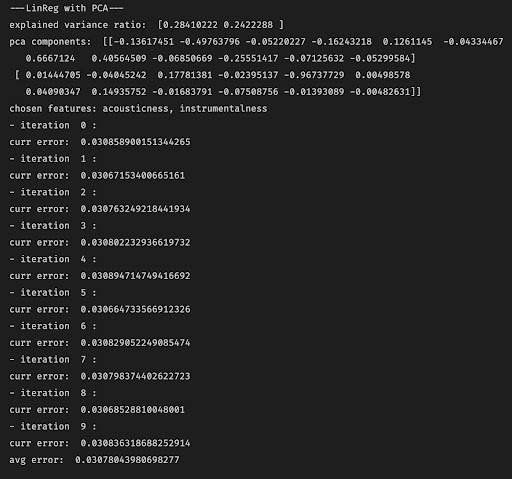

**Figure 11: Average Root Mean-Squared Error Across 10 K-Folds**

Each iteration represents the training of our model on 9 K-Folds with the remaining one used for testing. This occurred 10 times with 10 distinct groups of 9 K-Folds for training and 1 K-Fold for testing. The root mean-squared error for each iteration is shown above as well as the average root mean-squared error across all iterations. Root mean-squared error (RMSE) is a very similar metric to MSE (described above). Simply put, RMSE is the square root of MSE. RMSE has the same range of values (from 0 to 1), as the values in our dataset. Using this idea, it can be seen that an average RMSE of 0.03078 is still very low, indicating our predictions are very accurate. 

#### 4.2 Ridge Regression
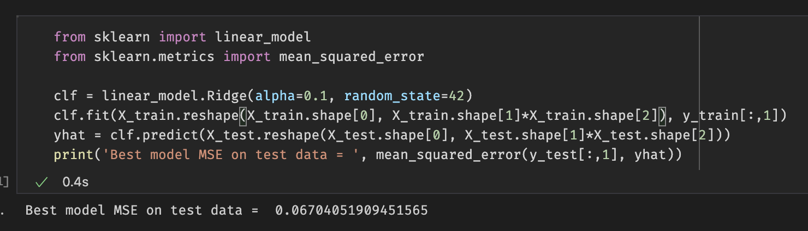
**Figure 12: Ridge Regression MSE**

When we used ridge regression for our input we obtained an MSE as shown above as 0.06704051909451565. 

#### 4.3 Lasso Regression
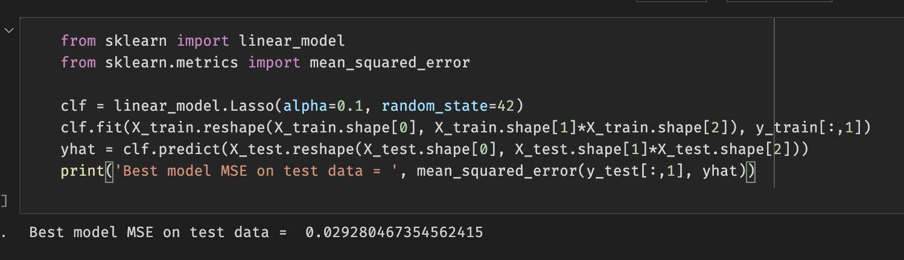
**Figure 13: Lasso Regression MSE**

When using lasso regression we trained our model and used the playlist features to represent an array with dimensions (75,13). The 75 comes from the max length of our playlist minus 1 (which is to account for the last song , and the 13 is the number of numerical features of a song. The ground truth that was used for this method was a 13 dimensional vector that is the last song of a given playlist which is used as a heuristic for a recommended song. With the use of lasso regression our recommended song MSE was lower than that of ridge regression because lasso regression allowed use to pad the playlist features (to the max length of a playlist in our dataset minus one since the last song will be the ground truth vector) to get greater prediction accuracy and less error to model our function. Lasso regression uses variable selection to increase prediction accuracy such we can relate this to why it also had a lower MSE value in comparison to ridge regression for our data as there are certain features that provide more importance to predicting the danceability than others. We used the last song in a playlist as the ground truth such that it would be the predicted song for a playlist. 

MSE that was obtained for ridge regression is higher than that of lasso regression. This showed that for the purpose of song prediction using danceability and the given datasets, lasso regression is better. One of the main reasons for this is that ridge regression does not have feature selection which dilutes the results of ridge regression to be used for song prediction. 

#### 4.4 Convolutional Neural Network 
The following graph shows the MSE of both the training and testing data by the epoch number. Our best MSE value for this model was around 0.068, which is somewhat high compared to other methods. We spent a significant amount of time tweaking the parameters, but there is further work to be done on the overall model architecture. Using CNNs in this way for regression is still a relatively new technique, and research into this is still in an early phase. 

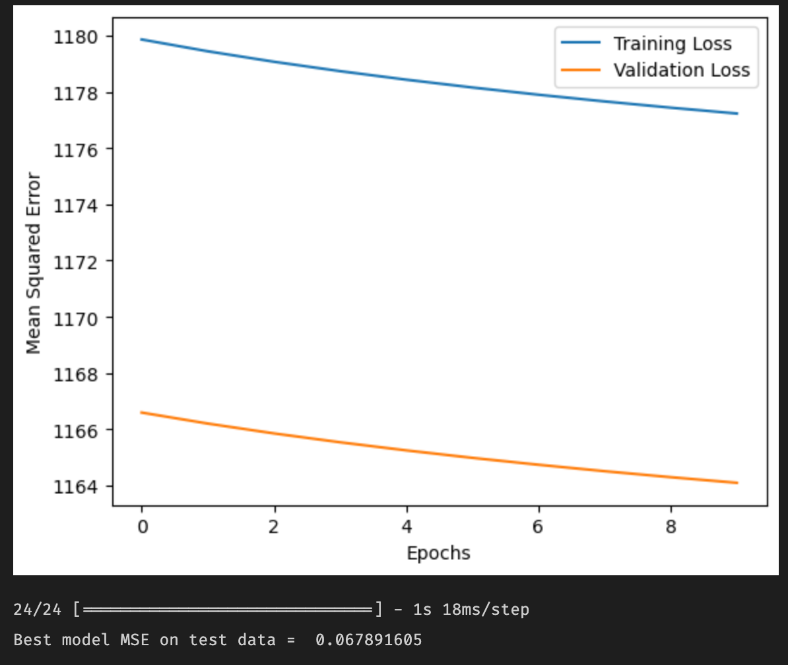

**Figure 14: CNN Loss Graph**

#### 4.5 Random Forest Implementation
To validate the results of our Random Forest model, we looked at MSE and RMSE. Our best MSE was 0.030524, and our best RMSE was 0.17471. Both of these values are relatively low, indicating that this model has pretty good accuracy. These values can be seen in the visualization shown below:
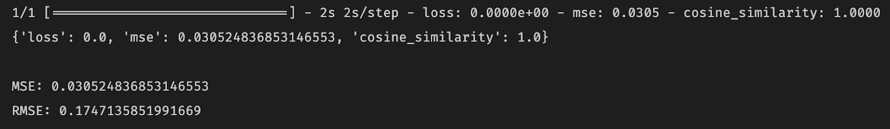
**Figure 15: Random Forest MSE**

### 5. Conclusions & Impact
As expected, none of our implemented models performed perfectly. The world is an imperfect place, and it would be naive to hope for perfect results. Despite this, our models still performed well. Across the board, we had low MSE values, which suggests that any of our implemented models could generate accurate predictions. However, for the task of predicting the next song’s danceability, the Lasso Regression method performed best. Random Forest and Ridge Regression performed slightly worse. From a theoretical standpoint, it makes sense that the Lasso Regression model was the most effective. This model is able to better select and weight features than other models, which proved important for this problem due to the fact that some features contributed much more to danceability than others. Our CNN model performed more poorly than some of the simpler models that were implemented, which could be due to hyperparameters. Despite the efforts put into this project, there is always room to improve in tweaking hyperparameters, which could improve overall accuracy. 

With popular retrospectives like Spotify Wrapped and Apple Music Replay being released at the end of each year, the relevancy of the danceability analyzer is heightened. As this project comes to an end it just so happens to be the time when this information is released by Spotify and Apple Music. Spotify Wrapped and Apple Music Replay provide users with their yearly listening statistics such as how many minutes they listened to, top artists, top songs, top albums, and so on. Each of these categories comes with a little more detail as well. There is no metric for danceability released by these platforms. With that said, our danceability analyzer can be something that could be added to such wraps or replays implemented as an extra engine or extension. It would provide users with more information about their music listening habits.

### 6. Miscellaneous

#### 6.1 Contribution Table

### 7 References
Götting, M. C. (2022, June 16). Global Streaming Music subscribers 2021. Statista. Retrieved October 7, 2022, from https://www.statista.com/statistics/669113/number-music-streaming-subscribers/ 

Pau, K. (2021, December 2). Spotify wrapped, unwrapped. Vox. Retrieved November 12, 2022, from https://www.vox.com/culture/22814121/spotify-wrapped-2021-algorithm-data-privacy 

See Apple Music replay to find your most listened to artists and songs. Apple Support. (2022, October 31). Retrieved November 12, 2022, from https://support.apple.com/en-us/HT210751#:~:text=With%20Apple%20Music%20Replay%2C%20you,re%20subscribed%20to%20Apple%20Music 

De Boom, C. (2020). Spotify Million Playlist Dataset Challenge. Retrieved 2022. 

Thierry Bertin-Mahieux, Daniel P.W. Ellis, Brian Whitman, and Paul Lamere. The Million Song Dataset. In Proceedings of the 12th International Society for Music Information Retrieval Conference (ISMIR 2011), 2011.

Mahajan, A. (2021, June 14). Exploring Spotify Dataset. Kaggle. Retrieved November 12, 2022, from https://www.kaggle.com/code/alankarmahajan/exploring-spotify-dataset 

Pedregosa et al. (2011). Scikit-learn: Machine Learning in Python, JMLR 12, pp. 2825-2830.

Michael (https://stats.stackexchange.com/users/5464/michael), Using principal component analysis (PCA) for feature selection, URL (version: 2021-04-08): https://stats.stackexchange.com/q/27300

Brownlee, J. (2020, August 14). Linear regression for machine learning. Machine Learning Mastery. Retrieved November 12, 2022, from https://machinelearningmastery.com/linear-regression-for-machine-learning/ 

Stephanie, G. (2021, February 6). Ridge regression: Simple definition. Statistics How To. Retrieved December 6, 2022, from https://www.statisticshowto.com/ridge-regression/ 

Kumar, D. (2022, October 31). A complete understanding of lasso regression. Great Learning Blog: Free Resources what Matters to shape your Career! Retrieved December 6, 2022, from https://www.mygreatlearning.com/blog/understanding-of-lasso-regression/

Binieli, M. (2018, October 8). Machine learning: An introduction to mean squared error and regression lines. freeCodeCamp.org. Retrieved November 12, 2022, from https://www.freecodecamp.org/news/machine-learning-mean-squared-error-regression-line-c7dde9a26b93/ 

Kam, T. H. (1995). Random decision forests. Proceedings of 3rd International Conference on Document Analysis and Recognition. https://doi.org/10.1109/icdar.1995.598994 

Dembla, G. (2020, November 17). Intuition behind log-loss score - towardsdatascience.com. Towards Data Science. Retrieved November 12, 2022, from https://towardsdatascience.com/intuition-behind-log-loss-score-4e0c9979680a 

Pardoe, I. (2022). 15.6 - nonlinear regression: Stat 501. PennState: Statistics Online Courses. Retrieved November 12, 2022, from https://online.stat.psu.edu/stat501/lesson/15/15.6 

Yehoshua, R. (2018, March 8). Recurrent Neural Networks (RNNs). Retrieved October 7, 2022, from https://www.cs.cmu.edu/~mgormley/courses/10601-s18/slides/lecture17-rnn.pdf

Deutschman, Z. (2022, July 22). Recommender Systems: Machine Learning Metrics and business metrics. neptune.ai. Retrieved October 7, 2022, from https://neptune.ai/blog/recommender-systems-metrics 
 

